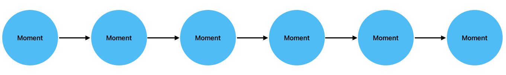
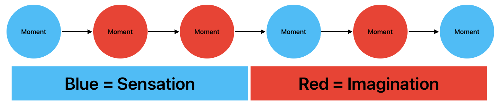
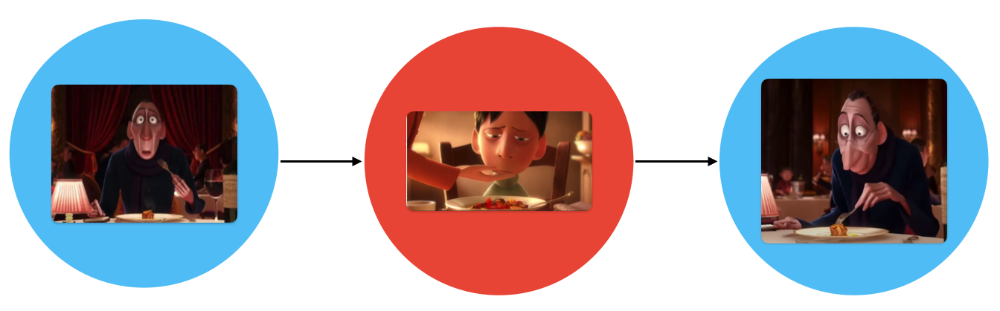
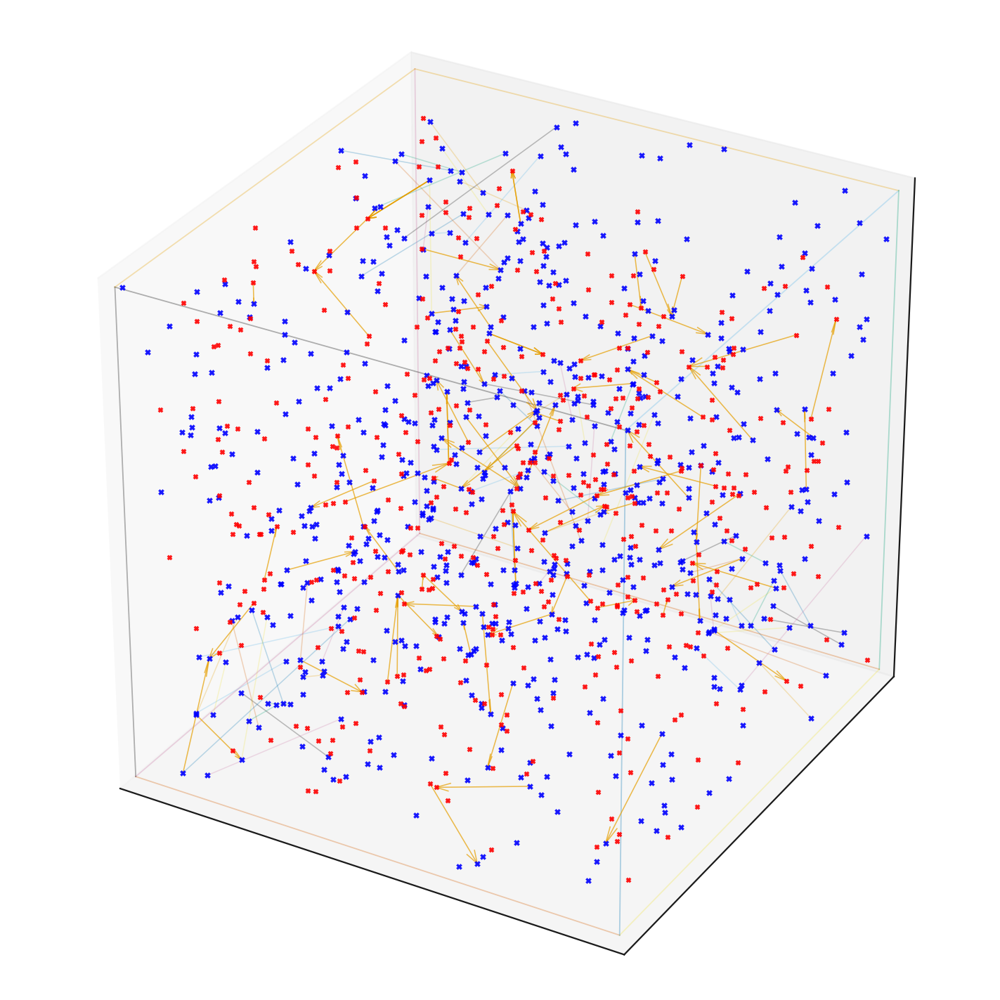

# Looking For A Word

If this is a moment.

  

Then life is something like this.

  

You can group moments into **sensation** & **imagination**.

  

Some examples...  

| Sensation              | Imagination                      |
|-------------------------------|-------------------------------|
| Hearing yourself speak.       | Hearing your internal monologue.            |
| Hearing music. | Hearing a melody that's stuck in your head.|
| Seeing an elephant.           | Picturing an elephant that isn't there.     |

They can activate each other.

You can start to model your life as a space of possible moments.

You can define a few terms using this framing:

World Model: How closely imagination predicts sensation.  
Non-Duality: Being fully aware of the current moment (as it).  
Concentration: Experiencing more moments within a smaller area of the graph.  
Metta: Concentrating on: Suffering -> Compassion & Happiness -> Empathy 

There are words in neuroscience for when imagination gets really close to reality, like "motor imagery".

**Is there a word for constraining (subjective) experience to only imagination or sensation?**

